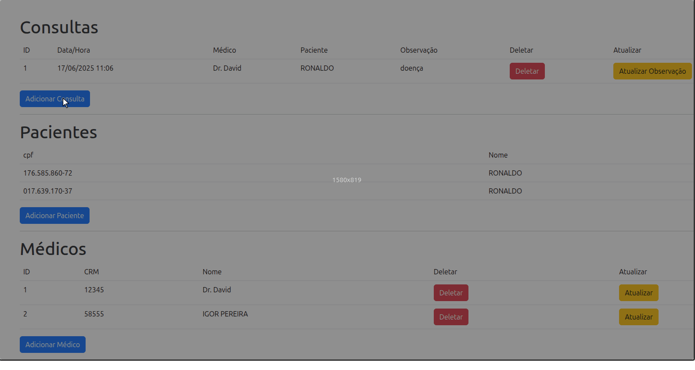

# consultas_medicas

Um sistema de controle de consultas médicas web com Flask conectado a um banco de dados PostgreSQL. O sistema inclui cadastro, edição, listagem e exclusão de médicos, pacientes e consultas, com uso de DAO, conexão via psycopg2, e templates HTML.

Já na base de dados o sistema de controle de consultas médicas inclui validação de CPF, auditoria, notificações, regras de agendamento, e registro de histórico, tudo com uso intenso de triggers e funções PL/pgSQL no PostgreSQL.

## Demo



## 👨‍⚕️👩‍⚕️ Operações com Médicos

* MedicoDAO: contém métodos para:

* Adicionar, editar, obter e deletar médicos.

* Listar todos os médicos (listar_todos()).

## 🧍‍♂️🧍 Operações com Pacientes

PacienteDAO: permite:

* Adicionar e obter pacientes.

* Listar todos com CPF mascarado (usando a função SQL mascaraCPF()).

## 🗓️ Operações com Consultas

ConsultaDAO: gerencia consultas:

* Adicionar nova consulta.

* Deletar consulta.

* Atualizar observação da consulta.

* Listar todas as consultas com nome do médico e paciente.

## 🔎 Funcionalidades implementadas no BD

### Validação e formatação de CPF

* validaCPF(): função PL/pgSQL que valida CPFs conforme o algoritmo oficial.
* mascaraCPF(): formata o CPF com pontos e traços.

### Auditoria e histórico
* paciente_audit: registra operações INSERT, UPDATE e DELETE em paciente.
* consulta_log: armazena log das consultas, especialmente quando deletadas.
* medico_log: registra inserções de médicos.


### Triggers inteligentes

🚫 Impede consultas aos sábados e domingos.

🚫 Impede que um médico tenha mais de 5 consultas no mesmo dia.

✅ Insere automaticamente histórico da observação da consulta.

✅ Notifica por e-mail ao cadastrar paciente (via notificacoes_pendentes).

✅ Converte o nome do médico para maiúsculas.

✅ Deleta automaticamente consultas de um médico removido.

### Funções auxiliares

* obter_medico(id): retorna o nome do médico dado o id.
* Outras funções que inserem logs, notificações ou controlam regras de negócio.


⚙️ Principais conceitos aplicados

| Conceito                       | Aplicação no script                                              |
| ------------------------------ | ---------------------------------------------------------------- |
| **Normalização**               | Tabelas separadas para cliente, médico, paciente, consulta, etc. |
| **PL/pgSQL**                   | Usado para triggers e regras complexas de negócio                |
| **Triggers**                   | Garantem integridade, automação e rastreamento                   |
| **Auditoria**                  | Com `paciente_audit`, `consulta_log`, `medico_log`               |
| **Controle de fluxo**          | Regras de CPF, agendamento, limite diário                        |
| **Boas práticas de segurança** | Validação de dados, uso de triggers, estrutura modular           |

🧪 Testes e Execução
Instruções de execução no final:

```bash
python3 -m venv .venv
. .venv/bin/activate
pip install -r requirements.txt 
flask --app index run
```

✅ Em resumo:

É um sistema web completo (CRUD) de agendamento de consultas médicas com Flask e PostgreSQL, separado por camadas (modelo, DAO, interface), e que tira proveito das triggers e funções PL/pgSQL do banco PostgreSQL.
